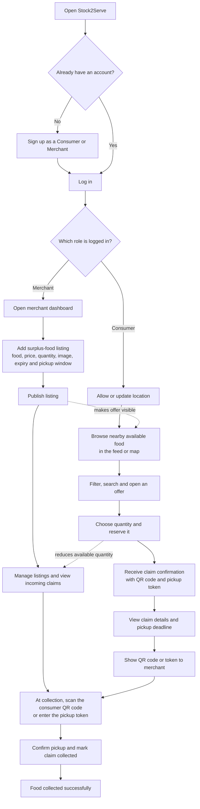
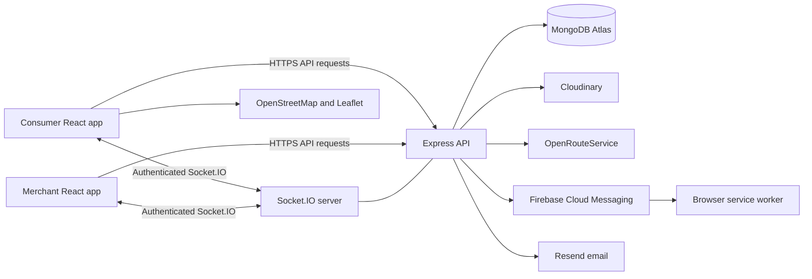
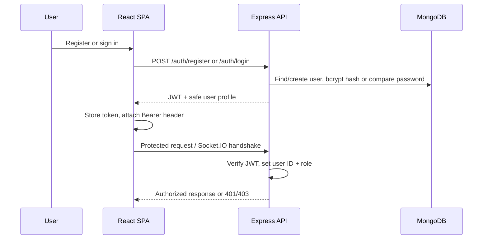
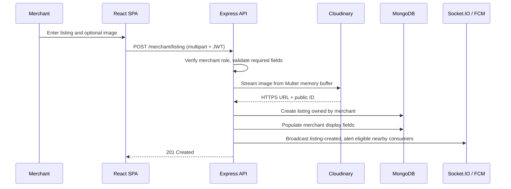
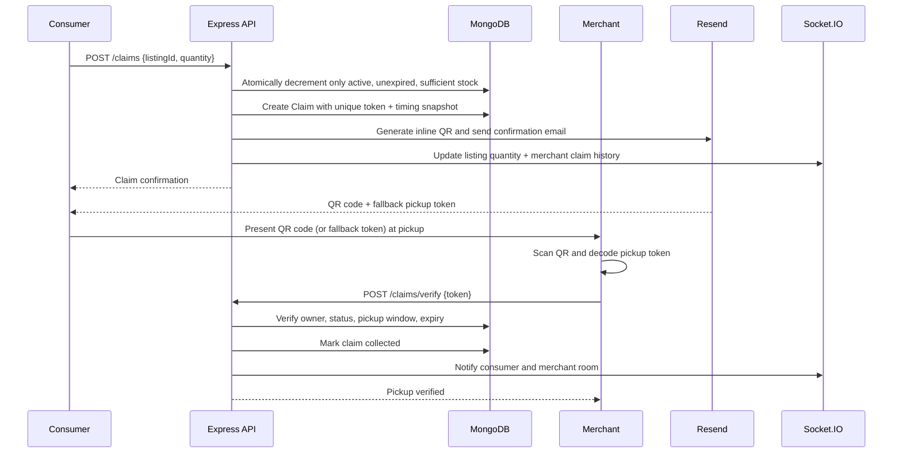
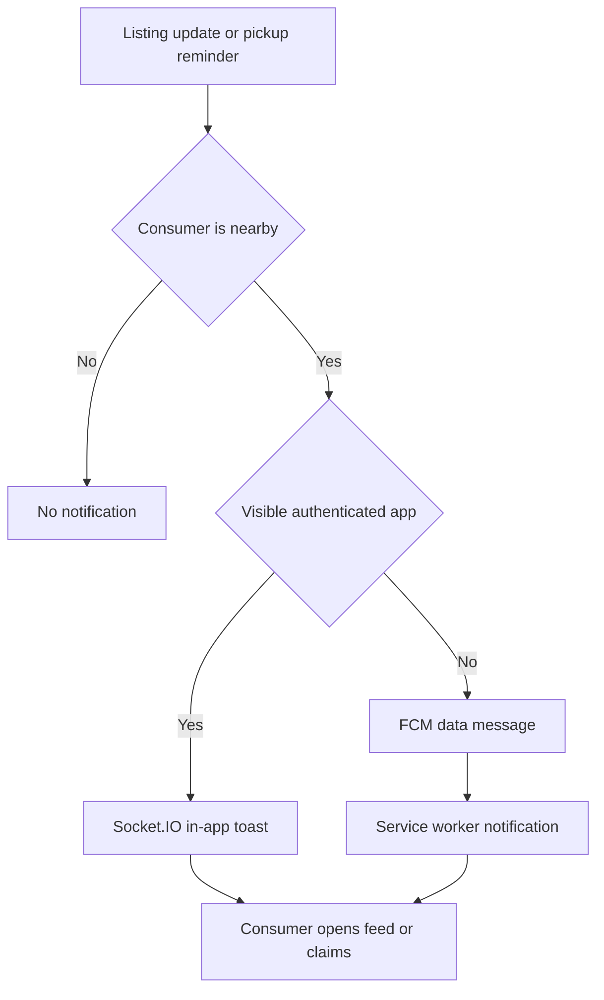
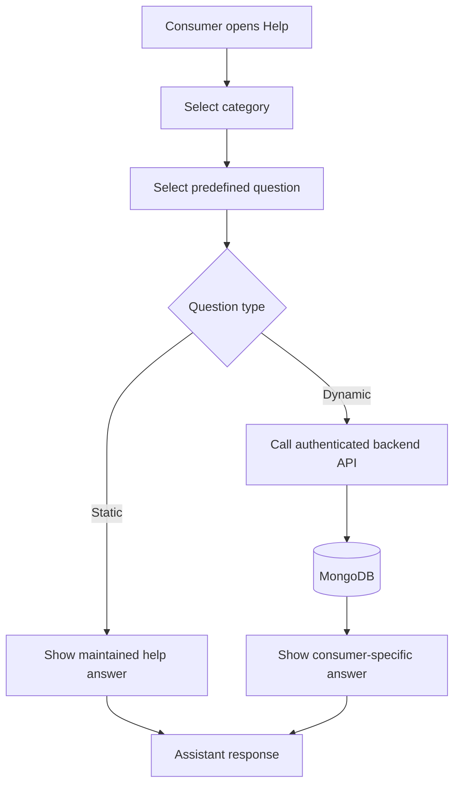
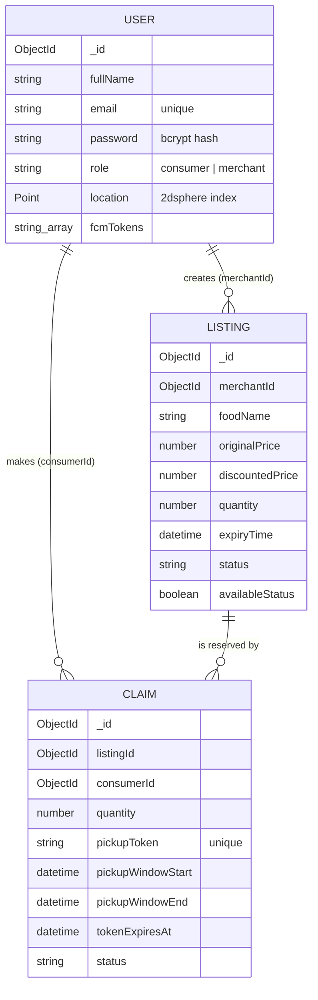
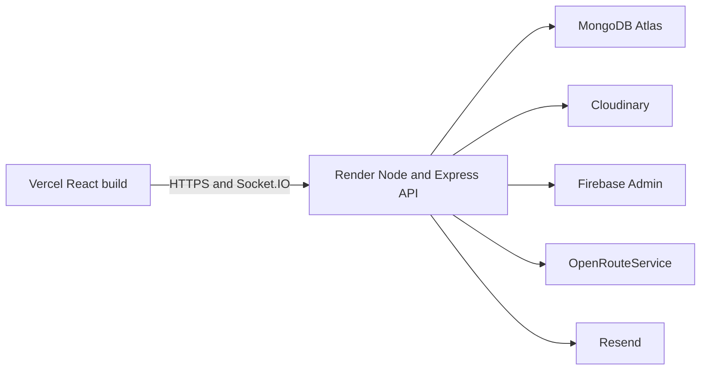

<div align="center">

<!-- Replace this placeholder with the official Stock2Serve logo when available. -->


# Stock2Serve

### Location-aware surplus-food marketplace for turning end-of-day inventory into accessible local meals.

[](https://react.dev/)
[](https://nodejs.org/)
[](https://expressjs.com/)
[](https://www.mongodb.com/atlas)
[](https://socket.io/)
[](#license)

[Architecture](#system-architecture) · [API](#api-reference) · [Setup](#installation) · [Deployment](#deployment) · [Contributing](#contributing)

</div>

> [!NOTE]
> Stock2Serve is a portfolio-grade MERN application with a real implementation of role-based access, geospatial discovery, reservations, real-time state updates, browser push notifications, media delivery, and pickup verification. This README deliberately distinguishes implemented functionality from recommended production hardening.

## Table of contents

- [Introduction](#introduction)
- [How Stock2Serve works](#how-stock2serve-works)
- [Current UI highlights](#current-ui-highlights)
- [Problem, rationale, and objectives](#problem-rationale-and-objectives)
- [Product capabilities](#product-capabilities)
- [Frontend loading feedback](#frontend-loading-feedback)
- [Technology decisions](#technology-decisions)
- [System architecture](#system-architecture)
- [Workflows](#workflows)
- [Data model](#data-model)
- [Repository structure](#repository-structure)
- [Modules and feature implementation](#modules-and-feature-implementation)
- [Stock2Serve Assistant](#stock2serve-assistant)
- [API reference](#api-reference)
- [Real-time and notification design](#real-time-and-notification-design)
- [Security, performance, and scalability](#security-performance-and-scalability)
- [Installation](#installation)
- [Configuration](#configuration)
- [Deployment](#deployment)
- [Testing and quality](#testing-and-quality)
- [Screenshots](#screenshots)
- [Challenges and engineering decisions](#challenges-and-engineering-decisions)
- [Roadmap](#roadmap)
- [Contributing](#contributing)
- [License](#license)
- [Acknowledgements](#acknowledgements)
- [Author and contact](#author-and-contact)

## Introduction

Stock2Serve connects local food merchants with nearby consumers who can claim surplus food before it expires. Merchants publish time-bound, discounted listings; consumers discover eligible offers within a 10 km radius, reserve portions, receive a pickup QR code by email (with the existing pickup token as a fallback), and complete collection at the merchant counter.

The application is designed around the operational constraints of surplus food: inventory changes quickly, pickup windows matter, physical proximity is essential, and an accepted reservation must not be oversold. The architecture therefore treats location, stock decrement, expiry, notifications, and pickup verification as first-class concerns.

## How Stock2Serve works

Stock2Serve gives surplus food a second chance: a **merchant** posts food that would otherwise go unsold, and a nearby **consumer** reserves it and collects it during the stated pickup window. Both people start at the same login screen, then see the tools for their role.



In short: **merchants list surplus food, consumers find and reserve it nearby, and the merchant verifies collection with the reservation QR code or token.** Listings, quantities, claim status, and reminders are kept up to date so both sides can follow the same transaction.

## Current UI highlights

- Calculated discount ribbons are displayed prominently on food images in both the consumer feed and merchant inventory.
- Available quantity and consumer claim status are displayed as high-contrast, easy-to-scan indicators.
- Consumer maps show a walking route line and a route summary card with estimated distance and walking time after a route is requested.
- Consumer and merchant dashboards, profile pages, claims, inventory, pickup, and listing panels use a consistent thin brown card outline.
- Desktop consumer navigation includes page icons, while mobile navigation keeps the current page clearly highlighted.

## Problem, rationale, and objectives

### Problem statement

Food businesses often have safe, sellable stock at the end of a trading period but lack a low-friction way to expose it to nearby customers in time. Manual coordination is slow, listings become stale, and consumers cannot reliably know what is still available or where to collect it.

### Why Stock2Serve

| Stakeholder | Operational problem | Stock2Serve response |
| --- | --- | --- |
| Merchant | Surplus food has a short selling window. | Creates an availability-controlled listing with price, quantity, image, pickup window, and expiry. |
| Consumer | Nearby availability is fragmented and changes rapidly. | Shows active offers from merchants within 10 km, with map discovery, filters, and live updates. |
| Both parties | A verbal reservation is hard to validate. | Issues a QR pickup pass with a unique fallback pickup token and gives the merchant an explicit verification workflow. |
| Platform | Stale inventory and late pickups erode trust. | Uses atomic stock decrement, claim expiry checks, countdowns, Socket.IO updates, and FCM reminders. |

### Objectives

1. Reduce avoidable food waste by making surplus inventory discoverable before expiry.
2. Preserve merchant control over availability, quantities, and pickup windows.
3. Give consumers accurate local discovery, transparent time constraints, and a verifiable reservation.
4. Keep the core transaction path safe under concurrent claim attempts.
5. Provide an extensible foundation for production deployment on managed infrastructure.

## Product capabilities

### Role capability comparison

| Capability | Consumer | Merchant |
| --- | :---: | :---: |
| Register, sign in, reset password, manage profile | ✓ | ✓ |
| Share/update location for nearby discovery | ✓ | — |
| Discover nearby offers and map merchants | ✓ | — |
| Claim a quantity and receive a QR pickup pass with fallback token | ✓ | — |
| View claim status and pickup reminder | ✓ | — |
| Create, edit, deactivate, or delete listings | — | ✓ |
| View inventory, dashboard metrics, and claim history | — | ✓ |
| Scan a pickup QR code or verify a fallback token, then mark collection complete | — | ✓ |

| Area | Implemented capability | User value | Implementation summary |
| --- | --- | --- | --- |
| Identity | Consumer and merchant registration, login, profile management, and password reset OTP. | Separate experiences without separate applications. | JWT claims carry user ID and role; protected client routes and server checks enforce access. |
| Merchant inventory | Create, edit, activate/deactivate, delete, and view food listings with images. | Fast publication of surplus stock. | Multipart upload through Multer; assets stored in Cloudinary; listing ownership scoped to the authenticated merchant. |
| Nearby discovery | Feed, search, veg/non-veg filter, trending cards, now-offer highlights, and nearby merchant map. | Relevant offers instead of a global, stale catalogue. | MongoDB GeoJSON / `2dsphere` search returns merchants within 10 km, then active unexpired listings. |
| Reservations | Quantity-aware claim with a generated token, QR confirmation email, and pickup-time snapshot. | A clear, auditable handover mechanism. | Atomic `findOneAndUpdate` decrements stock only if sufficient quantity remains, then persists a `Claim`; QR generation/email delivery runs afterward and cannot reverse the reservation. |
| Pickup operations | Merchant QR scan/fallback-token verification and claim history. | Prevents duplicate collection and keeps the counter workflow simple. | The scanner decodes the QR then calls the existing token endpoint; it is ownership-checked, expiry/window-checked, and transitioned to `collected`. |
| Realtime | Listing, quantity, and claim-status events. | Open screens do not need manual refreshes. | Authenticated Socket.IO rooms isolate consumer and merchant claim events. |
| Notifications | Foreground Socket.IO alerts and background FCM alerts/reminders. | Consumers are notified without duplicate foreground push noise. | Presence-aware routing uses sockets when the app is visible and FCM otherwise. |
| Stock2Serve Assistant | A global, click-only help assistant with static and account-aware responses. | Help is available without leaving the current screen or typing a query. | Predefined categories and question IDs select a safe static answer or call the existing authenticated listings/claims APIs. |
| Mapping | OpenStreetMap base map and OpenRouteService walking route. | Better pickup planning. | React Leaflet renders nearby merchants; backend proxies walking directions using server-held ORS credentials. |
| Email | QR claim confirmation and password-reset emails. | A durable reservation and recovery channel. | Resend sends HTML email with an inline QR PNG and fallback token; a failed confirmation email does not undo a successful claim. |

### Frontend loading feedback

API-backed user actions show an immediate, compact processing indicator so the interface does not appear idle while waiting for a response. The indicator uses the existing Stock2Serve amber visual language and utensils icon, works on desktop and mobile, does not block the page, and disappears in both success and error paths.

The shared component is `frontend/src/components/ProcessingIndicator/ProcessingIndicator.js`. It is used by the main alert-backed actions:

- Consumer claims: `claimFood` displays `🍽️ Processing claim...` and prevents duplicate claims with the existing `claimingId` state.
- Merchant inventory: listing creation/editing, deletion, and activation/deactivation display action-specific feedback and prevent duplicate inventory actions.
- Pickup verification: `verifyToken` displays `🍽️ Verifying pickup...` while preserving the existing success, error, expired-token, and informational SweetAlerts.
- Profile and account actions: consumer/merchant profile updates, login, signup, password-reset OTP, and password reset show action-specific feedback.

All request indicators are cleared through `finally` blocks or the existing request state cleanup. Existing SweetAlert messages, API endpoints, response handling, backend behavior, and business logic remain unchanged.

> [!TIP]
> “Trending” is intentionally local and time-bounded: it aggregates recent claims from the previous 10 minutes for nearby merchants, rather than presenting a platform-wide popularity metric.

## Technology decisions

| Technology | Why it was chosen | Where and how it is used | Benefit over alternatives for this project |
| --- | --- | --- | --- |
| React 19 + React Router | Component composition and role-specific client navigation. | `frontend/src`; protected consumer and merchant routes. | A single SPA keeps shared authentication and real-time UI state cohesive without duplicating views. |
| Node.js 20+ | Native async I/O and `fetch` fit API, socket, mail, and route-provider calls. | Express server and integration layer. | One JavaScript/TypeScript ecosystem reduces context switching for a MERN application. |
| Express 5 | Small, explicit HTTP composition model. | API routers, middleware, error boundary. | Lightweight compared with a full framework while retaining clear controller boundaries. |
| MongoDB Atlas + Mongoose | Flexible listing/user documents plus native geospatial operations. | `User`, `Listing`, and `Claim` models. | GeoJSON and `$near` support make radius discovery natural; Atlas supplies managed hosting. |
| JWT + bcryptjs | Stateless authentication with slow password hashing. | Auth controllers, HTTP middleware, Socket.IO handshake. | JWT supports separate Vercel/Render deployment; bcrypt protects stored passwords. |
| Socket.IO | Bidirectional events with room semantics and fallbacks. | Listing feed, claims, merchant history, foreground notices. | More suitable than polling for rapidly changing surplus inventory. |
| Firebase Cloud Messaging | Browser notifications when a consumer is not actively viewing the app. | Service worker, FCM token registration, Firebase Admin sender. | Complements sockets rather than replacing their low-latency foreground UX. |
| Cloudinary + Multer | Managed image storage and CDN delivery. | Profile and listing uploads held in memory then streamed to Cloudinary. | Avoids relying on Render’s ephemeral filesystem; Cloudinary supplies HTTPS delivery and lifecycle IDs. |
| Leaflet / React Leaflet + OpenStreetMap | Open map rendering without a proprietary map UI dependency. | Consumer Nearby Map. | Flexible, lightweight mapping with OpenStreetMap attribution and tiles. |
| OpenRouteService | Server-side walking directions. | `GET /api/listings/merchants/:merchantId/walking-route`. | Provides foot-routing geometry and distance/duration beyond straight-line distance. |
| Axios | Shared API client with authorization and 401 handling. | `frontend/src/services/api.js`. | Centralized API base URL and response interception reduce duplicated client plumbing. |
| Helmet + CORS | Baseline HTTP headers and allow-list browser origin policy. | `backend/server.js`. | Straightforward defense-in-depth at the application boundary. |
| Resend | Transactional email API. | Claim confirmation and reset OTP sender. | Simple API-based email delivery; email failures can be tracked without blocking the reservation. |
| `qrcode` + `html5-qrcode` | QR creation and browser camera scanning. | Server-side claim-email QR generation; merchant verification screen. | Keeps QR data limited to a claim ID and pickup token while reusing the existing verification endpoint. |
| Vercel + Render | Target split hosting for static SPA and long-lived Node/socket service. | Deployment topology documented below. | Vercel fits CRA static output; Render supports the API and WebSocket server. |

## System architecture



### Architectural boundaries

- **Presentation:** React routes, contexts, components, and map UI own user interaction and display state.
- **Application/API:** Express routes delegate to controllers; middleware authenticates requests and validates upload type/size.
- **Domain persistence:** Mongoose models represent users, listings, and claims. References model ownership and history relationships.
- **Integration layer:** Cloudinary, FCM, Resend, and OpenRouteService are kept behind configuration/utilities rather than called directly from the client.
- **Realtime boundary:** Socket.IO authenticates the handshake with the same JWT used by HTTP and emits private claim events to user rooms.

## Workflows

### Authentication and authorization



The client `ProtectedRoute` prevents the wrong UI route from rendering, while server-side controllers enforce the actual permission boundary. A merchant cannot verify another merchant’s pickup token; a consumer cannot create a listing or claim-history query as a merchant.

### Listing creation and publication



### Claim and pickup workflow



### Notification routing



The server schedules expiry checks and 30-minute pickup-reminder checks every 30 seconds after MongoDB connects. Claim status is also checked when the consumer loads claim history, which provides an additional consistency path.

## Stock2Serve Assistant

The floating **Help** button is available on every page. It opens a compact, mobile-friendly panel and does not navigate away from the current screen or cover the whole application.

The assistant intentionally uses predefined categories and question IDs rather than free-form AI generation. This keeps answers predictable, makes the personal-data boundary explicit, and avoids putting any AI or provider secret in the browser.

| Question type | Examples | Response source |
| --- | --- | --- |
| Static | Claim instructions, notification help, password help, security, map radius, and troubleshooting. | A version-controlled client-side help response. |
| Dynamic | Nearby food, food under ₹100, active/previous claims, pickup token, and pickup deadline. | Existing authenticated listings or claims API, scoped to the signed-in consumer. |



For sign-in failures, the API client lets the Login screen handle the expected `401` response. Login then shows a SweetAlert for invalid credentials instead of redirecting before the error can be displayed.

## Data model



| Collection | Responsibility | Key integrity and access decisions |
| --- | --- | --- |
| `users` | Shared account profile; merchant business details; consumer notification/location state. | Unique normalized email; `role` enum; password excluded from most responses; GeoJSON point maintained from latitude/longitude. |
| `listings` | Merchant-owned food offer and remaining quantity. | Category/status enums; price/quantity minimums; Cloudinary public ID is hidden by default. |
| `claims` | Reservation and collection record. | Unique pickup token retained as the fallback code; immutable-at-claim pickup timing snapshot; lifecycle `claimed → collected/expired` (or `cancelled`). The QR image itself is generated for the email and is not stored. |

### Index strategy implemented

| Index | Query it supports | Why it matters |
| --- | --- | --- |
| `users.location: 2dsphere` (sparse) | Nearby merchant and nearby-consumer lookups. | Makes the 10 km geospatial boundary queryable at scale. |
| `listings.merchantId, createdAt` | Merchant inventory view. | Supports owner-scoped newest-first retrieval. |
| `listings.merchantId, status, availableStatus, expiryTime` | Nearby active-listing filtering. | Narrows listings after nearby merchant IDs are identified. |
| `claims.consumerId, createdAt` | Consumer claim history. | Keeps newest-first personal history efficient. |
| `claims.listingId, createdAt` | Merchant claim history. | Supports claims across a merchant’s listings. |
| `claims.status, pickupReminderSentAt, tokenExpiresAt` | Expiry/reminder scans. | Supports periodic background lifecycle work. |

## Repository structure

```text
Stock2Serve/
├── backend/
│   ├── config/                 # Cloudinary, MongoDB helper, OpenRouteService integration
│   ├── controllers/            # Auth, merchant, listing, and claim application logic
│   ├── middleware/             # JWT authorization and in-memory image upload policy
│   ├── models/                 # Mongoose User, Listing, and Claim schemas/indexes
│   ├── routes/                 # HTTP route-to-controller contracts
│   ├── utils/                  # JWT, timing, email, Firebase, and notification helpers
│   ├── server.js               # Express, CORS, Helmet, Socket.IO, jobs, and server bootstrap
│   └── package.json
├── frontend/
│   ├── public/                 # Static assets and Firebase messaging service worker
│   ├── src/
│   │   ├── components/         # Shared UI, protected route, timers, foreground notices
│   │   ├── context/            # Authentication and shared consumer geolocation state
│   │   ├── layouts/            # Merchant page layout
│   │   ├── pages/              # Consumer, merchant, auth, and recovery experiences
│   │   ├── services/           # Axios client and Firebase browser integration
│   │   ├── utils/              # Formatting and client validation helpers
│   │   ├── routes.js           # Route map and role-gated route composition
│   │   └── App.js              # Application providers, routes, toasts, notifications
│   └── package.json
├── .gitignore                  # Secrets, node_modules, builds, logs, IDE/OS exclusions
└── README.md
```

## Modules and feature implementation

### Consumer module

| Feature | Purpose and user flow | Backend/data flow | Business value |
| --- | --- | --- | --- |
| Find Food feed | Consumer permits GPS (or falls back to profile coordinates), searches/filter offers, and chooses a quantity to claim. | Client calls `GET /listings?latitude&longitude`; server finds merchants in 10 km then active, available, non-empty, unexpired listings. | Reduces decision time and avoids showing infeasible offers. |
| Nearby Map | Consumer sees merchant markers, availability summaries, and optionally requests a walking route. | Merchant summaries are aggregated from eligible listings; route request uses ORS with the consumer’s coordinates. | Makes physical pickup practical, not merely discoverable. |
| My Claims | Consumer views reservation lifecycle and receives countdown/status updates. | Claims are populated with listing/merchant details; private socket events update a changed status. | Clarifies what must be collected and when. |
| Profile/location | Consumer updates personal details and location; location changes are sync-throttled by meaningful movement. | `PUT /auth/location` validates coordinates and updates the user GeoJSON point. | Keeps discovery and background notification targeting relevant. |

### Merchant module

| Feature | Purpose and user flow | Backend/data flow | Business value |
| --- | --- | --- | --- |
| Listing lifecycle | Merchant publishes or edits a food offer, its window, price, quantity, status, and image. | Listing is owner-scoped; image streams to Cloudinary; eligible changes emit real-time and background notices. | Lets a merchant convert unpredictable surplus into controlled, time-bound inventory. |
| Dashboard | Merchant reviews active listings, claims, completed pickups, recent listings, and derived metrics. | Dashboard combines owner listings and related claims. | Provides operational visibility in the same product used to publish stock. |
| Verify pickup | Merchant scans the consumer’s QR code or enters the fallback token at handover. A successful verification shows a “Pickup Collected” confirmation while retaining the page result message. | The QR scanner extracts only `{ claimId, pickupCode }` and submits its token to the existing `/api/claims/verify` endpoint; the server checks listing ownership, claim state, pickup start/end, and expiry before marking collected. | Prevents accidental or duplicate handover without creating a second redemption flow. |
| History | Merchant sees claim lifecycle in real time. | Claims for merchant-owned listing IDs are populated with consumer/listing details and updated by room events. | Supports reconciliation and customer-service context. |

### Asset, map, email, and recovery modules

- **Cloudinary image management:** uploads use Multer memory storage (5 MB maximum; JPEG/JPG/PNG/GIF/WebP). Cloudinary’s secure URL is stored for delivery and the `public_id` permits asynchronous cleanup on replace/delete. Legacy local/MongoDB image fallbacks remain readable.
- **OpenStreetMap and Leaflet:** the browser renders map tiles and current-location/merchant markers. The map remains a presentation concern; the server remains authoritative about nearby eligibility.
- **OpenRouteService:** the API validates consumer role and coordinates, applies a 10-second timeout, and returns walking-route geometry, distance, and duration. The ORS API key is never sent to the browser.
- **Email and password recovery:** a six-digit OTP with a 10-minute expiry is stored server-side and cleared after a valid reset. Claim confirmations include an inline QR image whose JSON payload contains only `claimId` and the existing fallback `pickupCode`; no password, JWT, or customer information is embedded. Email status is recorded as `sent`, `skipped`, or `failed` without reversing the already-committed claim.

## API reference

All protected endpoints require `Authorization: Bearer <JWT>`. Multipart endpoints accept the named image field shown below. Response examples are abbreviated to the primary payload.

### Authentication and profile

| Endpoint | Method | Auth | Request body | Success response | Status codes | Description |
| --- | --- | --- | --- | --- | --- | --- |
| `/api/auth/register` | POST | No | Multipart account fields; `profilePhoto` optional | `201 { token, user }` | 201, 400, 500 | Creates consumer or merchant account. |
| `/api/auth/login` | POST | No | `{ email, password }` | `{ token, user }` | 200, 401, 500 | Authenticates credentials. |
| `/api/auth/forgot-password` | POST | No | `{ email }` | `{ success: true }` | 200, 400, 404, 500 | Sends 6-digit reset OTP. |
| `/api/auth/reset-password` | POST | No | `{ email, otp, password }` | `{ success: true }` | 200, 400, 500 | Validates OTP and changes password. |
| `/api/auth/me` | GET | Yes | — | User document | 200, 401, 404, 500 | Returns current safe user profile. |
| `/api/auth/consumer/profile` | PUT | Yes | Multipart profile fields; `profilePhoto` optional | `{ user }` | 200, 400, 403, 500 | Updates consumer-owned profile. |
| `/api/auth/location` | PUT | Yes | `{ latitude, longitude }` | `{ success: true }` | 200, 400, 403, 404, 500 | Updates consumer location for discovery/alerts. |
| `/api/auth/fcm-token` | PUT | Yes | `{ token }` | `{ success: true }` | 200, 400, 403, 404, 500 | Adds a consumer browser FCM token. |
| `/api/auth/fcm-token` | DELETE | Yes | `{ token }` | `{ success: true }` | 200, 500 | Removes FCM token at logout. |
| `/api/auth/users/:id/profile-image` | GET | No | — | Image redirect/bytes | 302, 404 | Resolves Cloudinary or legacy profile image. |

### Listings and maps

| Endpoint | Method | Auth | Request body/query | Success response | Status codes | Description |
| --- | --- | --- | --- | --- | --- | --- |
| `/api/listings` | GET | Yes | Query: `latitude`, `longitude` | `{ listings }` | 200, 400, 500 | Returns eligible listings within 10 km. |
| `/api/listings/trending` | GET | Yes | Query: `latitude`, `longitude` | `{ trending }` | 200, 400, 500 | Top three nearby listings by claims in last 10 minutes. |
| `/api/listings/merchants` | GET | Yes | Query: `latitude`, `longitude` | `{ merchants }` | 200, 400, 500 | Map-ready nearby merchant summaries with availability. |
| `/api/listings/merchants/:merchantId/walking-route` | GET | Yes, consumer | Query: `latitude`, `longitude` | `{ route }` | 200, 400, 403, 404, 502, 503 | Returns ORS walking route. |
| `/api/listings/:id/image` | GET | No | — | Image redirect/bytes | 302, 404 | Resolves Cloudinary or legacy listing image. |
| `/api/merchant/listing` | POST | Yes, merchant | Multipart listing fields; `image` optional | `201 { listing }` | 201, 400, 403, 500 | Creates a merchant-owned listing. |
| `/api/merchant/listings` | GET | Yes | — | `{ listings }` | 200, 500 | Gets authenticated merchant listings. |
| `/api/merchant/listing/:id` | PUT | Yes | Multipart listing fields; `image` optional | `{ listing }` | 200, 400, 404, 500 | Updates an owned listing. |
| `/api/merchant/listing/:id` | DELETE | Yes | — | `{ success: true }` | 200, 404, 500 | Deletes an owned listing and schedules asset cleanup. |

### Claims and merchant operations

| Endpoint | Method | Auth | Request body | Success response | Status codes | Description |
| --- | --- | --- | --- | --- | --- | --- |
| `/api/claims` | POST | Yes, consumer | `{ listingId, quantity }` | `201 { claim }` | 201, 400, 403, 409, 500 | Atomically reserves available portions, issues the fallback pickup token, and sends the QR confirmation asynchronously. |
| `/api/claims/my` | GET | Yes, consumer | — | `{ claims }` | 200, 403, 500 | Gets consumer reservation history. |
| `/api/claims/:id/expire` | POST | Yes, consumer | — | `{ status }` | 200, 403, 404, 500 | Applies expiry status when the claim timing has elapsed. |
| `/api/claims/verify` | POST | Yes, merchant | `{ token }` | `{ claim, message }` | 200, 400, 403, 404, 409, 410, 500 | Validates and marks a pickup as collected. Both QR scanning and manual fallback-token entry use this unchanged endpoint. |
| `/api/merchant/profile` | GET | Yes | — | `{ user }` | 200, 404, 500 | Gets merchant profile. |
| `/api/merchant/profile` | PUT | Yes, merchant | Multipart profile fields; `profilePhoto` optional | `{ user }` | 200, 400, 403, 500 | Updates merchant/business profile. |
| `/api/merchant/dashboard-stats` | GET | Yes | — | `{ stats }` | 200, 500 | Gets merchant dashboard aggregates. |
| `/api/merchant/claim-history` | GET | Yes, merchant | — | `{ claims }` | 200, 403, 500 | Gets claims for the merchant’s listings. |

## Real-time and notification design

### Socket.IO events

| Event | Audience | Effect |
| --- | --- | --- |
| `listing-created` | Connected clients | Feed/map re-query authoritative nearby data. |
| `listing-updated` | Connected clients | Feed/map re-query changed eligible listing. |
| `listing-quantity-updated` | Connected clients | Feed updates remaining stock or removes zero-stock offer. |
| `merchant-claim-created` | Owning merchant room | Adds the new reservation to history. |
| `claim-updated` | Owning consumer room | Updates expired/collected reservation state. |
| `merchant-claim-updated` | Owning merchant room | Updates reservation lifecycle at the merchant. |
| `nearby-listing` | Foreground nearby consumer room | Shows an in-app nearby-offer toast. |
| `pickup-reminder` | Foreground consumer room | Shows persistent pickup reminder toast. |

Socket handshakes require the JWT. On connection, the server joins both `consumer:<userId>` and `merchant:<userId>` private rooms; role-sensitive controller code determines which room receives a particular event. Browser visibility is reported through `app-visibility`, allowing the server to avoid sending FCM to a foreground user who can receive the immediate socket event.

### Firebase Cloud Messaging

1. On consumer sign-in, the browser requests notification permission, registers the service worker, obtains an FCM token, and associates it with the authenticated consumer.
2. On a relevant listing change, the server uses a 10 km `$geoWithin` query to find nearby consumers.
3. Foreground recipients get Socket.IO UI messages; background recipients receive FCM data messages.
4. The service worker displays the notification and directs clicks to the feed or claims route.
5. A recurring job identifies unreminded claims expiring within 30 minutes and follows the same foreground/background split.

## Security, performance, and scalability

### Implemented controls

| Concern | Implementation | Outcome |
| --- | --- | --- |
| Authentication | Signed JWT, configurable expiry (default 7 days), verified for HTTP and Socket.IO. | Shared identity boundary across REST and realtime channels. |
| Authorization | Role-aware routes/controllers and owner-scoped listing/token checks. | Reduces cross-tenant data and operation access. |
| Passwords | bcrypt with cost factor 12 in a Mongoose pre-save hook. | Passwords are never stored in plaintext. |
| Secrets | `.env` ignored; API keys and deployment URLs read from environment. | Credentials stay out of source control when configured correctly. |
| HTTP hardening | Helmet plus explicit CORS origin allow-list. | Security headers and controlled browser origins. |
| Upload safety | Allow-listed image types, 5 MB cap, memory-only processing. | Bounds common upload abuse and avoids persistent server-disk reliance. |
| Data minimization | Passwords, FCM tokens, reset OTPs, and Cloudinary public IDs are excluded from normal API outputs. | Limits exposure of sensitive/internal fields. |
| Reservation integrity | Atomic conditional stock decrement before claim creation. | Prevents normal concurrent requests from claiming unavailable stock. |
| Lifecycle enforcement | Claim timing snapshot, scheduled expiry, token/window validation at pickup. | Keeps a later listing edit from changing an issued reservation. |
| Media delivery | Cloudinary secure URLs/CDN; old assets are cleaned asynchronously. | Keeps image serving away from the API process. |

### Performance decisions

- `lean()` is used on read-heavy user, listing, and history queries where Mongoose documents are not needed.
- Queries are projected to fields needed by the caller in several map, notification, and image flows.
- GeoJSON with a sparse `2dsphere` index moves proximity matching into MongoDB instead of filtering every merchant in application memory.
- Feed/map clients re-query after broad listing events so server-side eligibility (location, expiry, availability) remains the source of truth.
- The frontend avoids frequent GPS-triggered reloads by only synchronizing material movement (100 m threshold).

### Scalability path

| Current design | Next step when load requires it |
| --- | --- |
| One Express/Socket.IO instance | Add a Socket.IO adapter such as Redis and run multiple stateless API instances. |
| In-process 30-second lifecycle intervals | Move expiry/reminder work to a durable queue/scheduled worker with idempotent jobs. |
| Geospatial lookup then listing query | Add query telemetry, validate compound indexes with production explain plans, and consider read replicas where justified. |
| Direct integration calls in request/event paths | Use queue-backed notification/email delivery with retry/backoff and dead-letter observability. |
| Basic console logging | Adopt structured logs, request correlation IDs, metrics, tracing, and alerting. |

> [!WARNING]
> `express-rate-limit` is **not currently installed or configured** in this repository. Add route-specific rate limiting—especially for login, reset OTP, uploads, and claim creation—before exposing the service broadly. This README does not represent rate limiting as an implemented control.

### Production-ready improvements to prioritize

1. Add request validation (for example, Zod/Joi) and consistent machine-readable error codes.
2. Add rate limiting, brute-force protections, email/OTP attempt limits, and audit logging.
3. Move the JWT out of browser local storage to an appropriate secure-cookie/session design if the threat model requires XSS-resistant session handling.
4. Make claim creation a MongoDB transaction or adopt a recoverable outbox/reconciliation strategy to handle the rare failure after stock decrement but before claim persistence.
5. Add health/readiness endpoints, structured logging, error monitoring, and uptime alerts.
6. Add pagination/cursors for growing listing and claim histories.
7. Add tests, CI, dependency scanning, and deployment previews.

## Installation

### Prerequisites

- Node.js **20 or newer**
- npm
- MongoDB Atlas cluster or a local MongoDB instance
- Cloudinary account for uploads
- Firebase project and service credentials for push notifications (optional for core local use)
- OpenRouteService API key for walking directions (optional)
- Resend API key for email/OTP delivery (optional for core local use)

### Clone and install

```bash
git clone https://github.com/Sivag28/Stock2Serve.git
cd Stock2Serve

cd backend
npm install

cd ../frontend
npm install
```

### Run locally

Open two terminals from the repository root:

```bash
# Terminal 1
cd backend
npm run dev
```

```bash
# Terminal 2
cd frontend
npm start
```

The frontend starts at `http://localhost:3000`; the API defaults to `http://localhost:5000`. Allow browser location access to exercise nearby discovery and map behavior.

## Configuration

Create `backend/.env` locally. Environment files are intentionally ignored by Git.

```dotenv
# Required for authenticated API use
MONGO_URI=mongodb+srv://<user>:<password>@<cluster>/<database>?retryWrites=true&w=majority
JWT_SECRET=replace-with-a-long-random-secret
JWT_EXPIRE=7d
PORT=5000

# Comma-separated deployed SPA origins; localhost is already permitted by code
CORS_ORIGINS=https://your-frontend.vercel.app

# Required when creating/replacing images
CLOUDINARY_CLOUD_NAME=
CLOUDINARY_API_KEY=
CLOUDINARY_API_SECRET=

# Required for walking route endpoint
ORS_API_KEY=

# Required for claim confirmation and password reset email
RESEND_API_KEY=

# Required for server-originated FCM; use one approach
FIREBASE_SERVICE_ACCOUNT_JSON={"type":"service_account", "project_id":"..."}
# GOOGLE_APPLICATION_CREDENTIALS=/absolute/path/to/service-account.json
```

Create `frontend/.env` when using a deployed API or overriding Firebase web configuration:

```dotenv
REACT_APP_API_URL=https://your-api.onrender.com
REACT_APP_FIREBASE_API_KEY=
REACT_APP_FIREBASE_AUTH_DOMAIN=
REACT_APP_FIREBASE_PROJECT_ID=
REACT_APP_FIREBASE_STORAGE_BUCKET=
REACT_APP_FIREBASE_MESSAGING_SENDER_ID=
REACT_APP_FIREBASE_APP_ID=
REACT_APP_FIREBASE_VAPID_KEY=
```

> [!NOTE]
> The current Firebase web configuration has repository fallbacks for the public client identifiers. For clean environment separation, configure the `REACT_APP_FIREBASE_*` variables in each target environment and mirror the same Firebase configuration in `frontend/public/firebase-messaging-sw.js`.

### Configuration notes

- `server.js` currently reads `MONGO_URI` and falls back to a local `stock2serve` database. `config/db.js` uses `MONGODB_URI`, but that helper is not used by the active server bootstrap. Prefer `MONGO_URI` unless the application is refactored to use the helper consistently.
- Cloudinary/ORS/Resend/FCM integrations fail gracefully or remain unavailable when their respective configuration is absent; the core API still requires a valid JWT secret and MongoDB connection.
- Never commit real keys or service-account JSON. Configure secrets in the hosting provider dashboard.

## Deployment

The repository does not contain committed Vercel/Render configuration files, so the following is an operator runbook for the existing application topology rather than a claim of an already-provisioned deployment.



### Vercel: frontend

1. Import the GitHub repository into Vercel.
2. Set **Root Directory** to `frontend`.
3. Use build command `npm run build` and output directory `build`.
4. Add `REACT_APP_API_URL=https://<your-render-service>.onrender.com` and any Firebase web variables.
5. Deploy, then copy the Vercel URL for the backend `CORS_ORIGINS` setting.

### Render: backend

1. Create a new Web Service from the same repository with **Root Directory** `backend`.
2. Set build command `npm install` and start command `npm start`.
3. Select a Node runtime compatible with the project’s `>=20` engine requirement.
4. Add all backend variables from the configuration table, including `MONGO_URI`, `JWT_SECRET`, and `CORS_ORIGINS` with the exact Vercel origin.
5. Confirm WebSocket support and use the public Render URL as `REACT_APP_API_URL` in Vercel.

### MongoDB Atlas

1. Create a cluster/database user with least privilege for the application database.
2. Add the Render egress address/range or otherwise configure network access appropriately.
3. Put the escaped connection string in `MONGO_URI`.
4. Verify indexes from the Mongoose schemas are created and inspect query plans after realistic data is available.

### Post-deployment verification

- Register one merchant and one consumer.
- Verify CORS allows the Vercel domain and rejects unknown browser origins.
- Create an image-backed listing and confirm the Cloudinary redirect/image display path.
- Allow consumer geolocation and verify 10 km feed/map eligibility.
- Claim a listing from two sessions to validate stock behavior.
- Verify a pickup token from the owning merchant and ensure private real-time updates arrive.
- Test FCM in a background tab and ensure the service-worker click opens the correct route.

## Testing and quality

The frontend includes the Create React App/Jest testing toolchain (`npm test`), but this repository does **not** currently include a meaningful automated test suite. The backend `npm test` script intentionally exits with “no test specified.” This is an honest baseline, not a production-complete testing posture.

Recommended test strategy:

| Layer | Priority scenarios | Suggested approach |
| --- | --- | --- |
| Unit | Claim timing, coordinate validation, JWT behavior, price/quantity rules. | Jest/Vitest with pure utility tests. |
| API integration | Roles, ownership, concurrent claims, expiry, image validation, OTP lifecycle. | Supertest against ephemeral MongoDB or dedicated test database. |
| Realtime | Room authorization and emitted event payloads. | Socket.IO client integration tests. |
| E2E | Merchant creates → consumer claims → merchant verifies pickup. | Playwright/Cypress with seeded test accounts. |
| Security | CORS, unauthenticated access, IDOR, upload edge cases, rate-limit behavior after implementation. | Automated API checks plus manual security review. |

## Screenshots

Replace the placeholders below with repository-hosted images (recommended path: `docs/screenshots/`). Keep images compressed and provide meaningful alt text.

| Screen | What it demonstrates | Placeholder |
| --- | --- | --- |
| Consumer discovery feed | Nearby cards, search, veg/non-veg filtering, trending items, and expiry context. | `` |
| Nearby merchant map | 10 km radius, merchant markers, availability sheet, and walking route. | `` |
| Consumer claims | Pickup token, countdown, claim status, and reservation history. | `` |
| Merchant dashboard | Inventory/claim metrics and operational overview. | `` |
| Listing editor | Merchant’s listing form with image and pickup window controls. | `` |
| Pickup verification | Counter-side token validation and collected state. | `` |

## Challenges and engineering decisions

| Challenge | Decision | Result |
| --- | --- | --- |
| Inventory can change between a consumer viewing and claiming it. | Use conditional atomic decrement with `quantity: { $gte: requested }`. | Claim requests fail cleanly with 409 when stock is no longer available. |
| A listing edit must not change an already-issued reservation’s deadline. | Copy pickup window and expiry into the claim at creation time. | Reservation timing is stable and auditable. |
| Location feeds should not leak a global catalogue. | Query merchants by GeoJSON radius first and use their IDs to filter listings. | The backend, not the browser, enforces proximity. |
| Foreground and background notifications can duplicate each other. | Track socket visibility; use sockets for visible clients and FCM otherwise. | A clearer notification experience with a defined channel split. |
| Render-local disk is ephemeral. | Keep Multer uploads in memory and stream to Cloudinary. | Media survives deploys/restarts and is CDN-delivered. |
| Pickup windows can cross midnight. | Calculate India-time dates and roll the end time forward where required. | Window evaluation handles overnight pickup windows. |

## Roadmap

The following are intentionally future enhancements, not claims about the current repository:

- [ ] Add a formal `LICENSE` file and repository governance files (`CODE_OF_CONDUCT`, issue/PR templates).
- [ ] Introduce API request schemas, rate limiting, bot/abuse controls, and audit trails.
- [ ] Add automated unit, API, realtime, E2E, and accessibility coverage with CI.
- [ ] Add payment/reconciliation support if the product model requires digital payment.
- [ ] Add cancellation/relisting rules and merchant-side inventory recovery policies.
- [ ] Move notification/email/lifecycle jobs to durable background workers.
- [ ] Add observability: health checks, structured logs, metrics, tracing, and error reporting.
- [ ] Add multilingual/localization support and broader accessibility audits.

### Learning outcomes demonstrated

- Designing a role-based marketplace around a real-world, time-sensitive workflow.
- Applying MongoDB geospatial queries and indexes to location-aware discovery.
- Coordinating REST, Socket.IO, FCM, transactional email, and cloud image storage.
- Modeling reservation state, expiry, and pickup verification as explicit domain lifecycle rules.
- Making pragmatic trade-offs while documenting production gaps clearly.

## Contributing

Contributions are welcome once repository governance is established. Until then, use a focused branch and keep each pull request scoped to one concern.

1. Fork the repository and create a branch: `git checkout -b feat/short-description`.
2. Install dependencies in both `backend` and `frontend`.
3. Keep secrets out of commits; use local `.env` files only.
4. Follow the existing controller/model/component separation and preserve authorization checks server-side.
5. Add or update tests when test infrastructure is introduced; manually verify the relevant role flows today.
6. Open a PR explaining the user impact, architectural choice, validation performed, and screenshots for UI changes.

## License

No license file is currently present in this repository. Do not assume open-source reuse rights until the project owner adds an explicit license (for example, MIT, Apache-2.0, or a proprietary license appropriate to the intended distribution).

## Acknowledgements

- [React](https://react.dev/), [Express](https://expressjs.com/), [MongoDB](https://www.mongodb.com/), and [Socket.IO](https://socket.io/)
- [Cloudinary](https://cloudinary.com/), [Firebase Cloud Messaging](https://firebase.google.com/docs/cloud-messaging), and [Resend](https://resend.com/)
- [Leaflet](https://leafletjs.com/), [OpenStreetMap](https://www.openstreetmap.org/), and [OpenRouteService](https://openrouteservice.org/)

## Author and contact
### 👥 Maintainers

| Name | GitHub |
|------|--------|
| SIVASANKARI G | [Sivag28](https://github.com/Sivag28) |
| B UMA NANDHINI | [Umanandhini2004](https://github.com/Umanandhini2004) |
| MALINI A | [@member3](https://github.com/member3) |

For project questions, use [GitHub Issues](https://github.com/Sivag28/Stock2Serve/issues) or replace this line with the maintainer’s preferred public contact channel.
